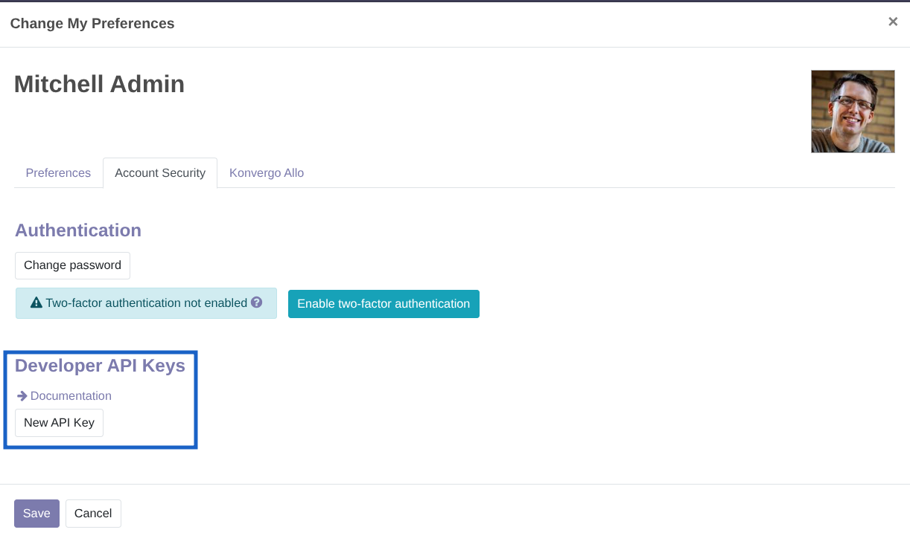
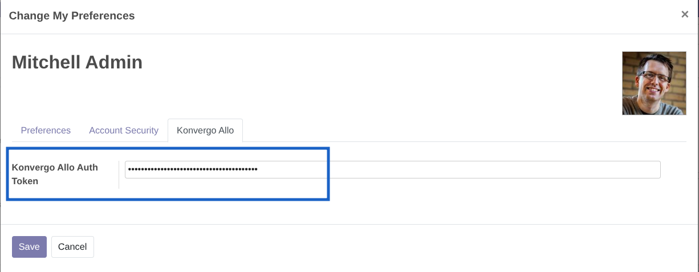

=====================
Konvergo MAGIC
=====================

This Konvergo ERP and Odoo module provides the baseline for the integration with `Konvergo MAGIC <https://konvergo.com/r/MdA>`_

Konvergo MAGIC depends on the use of `Konvergo Allo <https://konvergo.com/r/aCB>`_.

In the ERP, Konvergo Allo workflows configurations are setup in a new "Konvergo MAGIC" application: :ref:`Configuration`

.. contents:: Table of Contents

Overview
--------

A detailed showcase of Konvergo MAGIC's capabilities is featured on `our website <https://konvergo.com/r/MdA>`_

* Configure Konvergo Allo workflows to appear in Odoo
* Set up different workflows for different models
* Pass context information from the ERP to Konvergo Allo variables
* Configure custom themes for the chat bubbles

.. _Configuration:

Configuration
-------------

1. Install the module
2. Go to Konvergo MAGIC > Workflows
3. Create a new workflow configuration
4. Fill the form accordingly

User Configuration
------------------

Konvergo MAGIC uses the ERP implementation of API tokens to authenticate users throughout the workflows.
A new field is added on the users model to store an API key dedicated to the use of Konvergo MAGIC.

If this key is not set, an alert is shown on the user's screen that they should fill it.

1. Create a new dedicated API key

2. Paste its value in the Konvergo MAGIC Auth Token field, in the user's preferences

Using in Konvergo Allo
----------------------

When "Include Context" is enabled, the following variables will be available in your 
Konvergo Allo workflow:

* ``erp_auth_token``: The configured authentication token
* ``erp_base_url``: The URL of the ERP instance
* ``erp_view_type``: The type view the client is on
* ``erp_model``: The current model (e.g., "res.partner")
* ``erp_record_id``: The record ID when viewing a form
* ``erp_record_name``: The name of the current record if available
* ``erp_db_uuid``: The UUID of the database the client is on
* ``erp_db_name``: The name of the database the client is on
* ``erp_user_id``: The user ID of the client

These variables could be used in your Konvergo Allo workflows to create
dynamic experiences, or login to the ERP database for API operations.

Technical Information
---------------------

Konvergo Allo is loaded using the official Konvergo Allo JavaScript API. The module:

1. Checks for applicable Konvergo Allo configuration based on the current context
2. Loads the Konvergo Allo JavaScript library
3. Initializes the workflow chat bubble with the correct configuration (theme, etc.)
4. Passes context variables when the bubble is initialized
